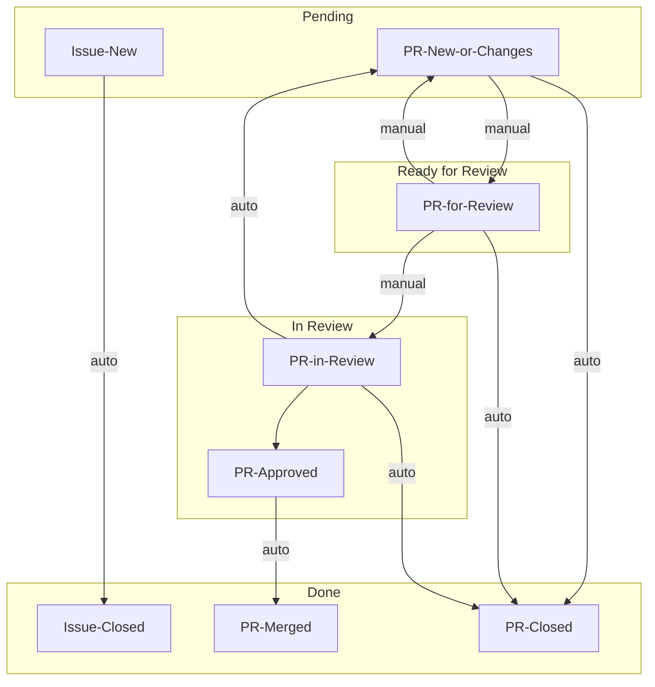

# DP Wizard

[](https://pypi.org/project/dp_wizard/)

Building on what we've learned from [DP Creator](https://github.com/opendp/dpcreator), DP Wizard offers:

- Easy installation with `pip install dp_wizard`
- Simplified single-user application design
- Streamlined workflow that doesn't assume familiarity with differential privacy
- Interactive visualization of privacy budget choices
- UI development in Python with [Shiny](https://shiny.posit.co/py/)

## Usage

```
usage: dp-wizard [-h] [--public_csv CSV] [--private_csv CSV] [--contrib CONTRIB] [--demo]

DP Wizard makes it easier to get started with Differential Privacy.

options:
  -h, --help         show this help message and exit
  --public_csv CSV   Path to public CSV
  --private_csv CSV  Path to private CSV
  --contrib CONTRIB  How many rows can an individual contribute?
  --demo             Use generated fake CSV for a quick demo

Use "--public_csv" if you have a public data set, and are curious how
DP can be applied: The preview visualizations will use your public data.

Use "--private_csv" if you only have a private data set, and want to
make a release from it: The preview visualizations will only use
simulated data, and apart from the headers, the private CSV is not
read until the release.

Use "--public_csv" and "--private_csv" together if you have two CSVs
with the same structure. Perhaps the public CSV is older and no longer
sensitive. Preview visualizations will be made with the public data,
but the release will be made with private data.
```


## Development

This is the first project we've developed with Python Shiny,
so let's remember [what we learned](WHAT-WE-LEARNED.md) along the way.

### Getting Started

To get started, clone the repo and install dev dependencies in a virtual environment:
```shell
$ git clone https://github.com/opendp/dp-wizard.git
$ cd dp-wizard
$ python3 -m venv .venv
$ source .venv/bin/activate
$ pip install -r requirements-dev.txt
$ pre-commit install
$ playwright install
```

Now install the application itself and run it:
```shell
$ pip install --editable .
$ dp-wizard --demo
```
Your browser should open and connect you to the application.

### Testing

Tests should pass, and code coverage should be complete (except blocks we explicitly ignore):
```shell
$ ./ci.sh
```

We're using [Playwright](https://playwright.dev/python/) for end-to-end tests. You can use it to [generate test code](https://playwright.dev/python/docs/codegen-intro) just by interacting with the app in a browser:
```shell
$ dp-wizard # The server will continue to run, so open a new terminal to continue.
$ playwright codegen http://127.0.0.1:8000/
```

You can also [step through these tests](https://playwright.dev/python/docs/running-tests#debugging-tests) and see what the browser sees:
```shell
$ PWDEBUG=1 pytest -k test_app
```

If Playwright fails in CI, we can still see what went wrong:
- Scroll to the end of the CI log, to `actions/upload-artifact`.
- Download the zipped artifact locally.
- Inside the zipped artifact will be _another_ zip: `trace.zip`.
- Don't unzip it! Instead, open it with [trace.playwright.dev](https://trace.playwright.dev/).

### Release

- Make sure you're up to date.
- Make one last feature branch:
  - Run `changelog.py` to update the `CHANGELOG.md`.
  - Then bump `dp_wizard/VERSION`, and add the new number at the top of the `CHANGELOG.md`.
  - Push to github; open PR, with version number in name; merge PR.
- `flit publish`

### Conventions

Branch names should be of the form `NNNN-short-description`, where `NNNN` is the issue number being addressed.

Dependencies should be pinned for development, but not pinned when the package is installed.
New dev dependencies can be added to `requirements-dev.in`, and then run `pip-compile requirements-dev.in` to update `requirements-dev.txt`

A Github [project board](https://github.com/orgs/opendp/projects/10/views/2) provides an overview of the issues and PRs.
When PRs are [Ready for Review](https://github.com/orgs/opendp/projects/10/views/2?filterQuery=status%3A%22Ready+for+Review%22) they should be flagged as such so reviewers can find them.


- For `manual` transitions, the status of the issue or PR will need to be updated by hand, either on the issue, or by dragging between columns on the board.
- For `auto` transitions, some other action (for example, approving a PR) should trigger a [workflow](https://github.com/orgs/opendp/projects/10/workflows).
- These are the only the states that matter. Whether PR is a draft or has assignees does not matter.
- If we need anything more than this, we should consider a paid plan, so that we have access to more workflows.
